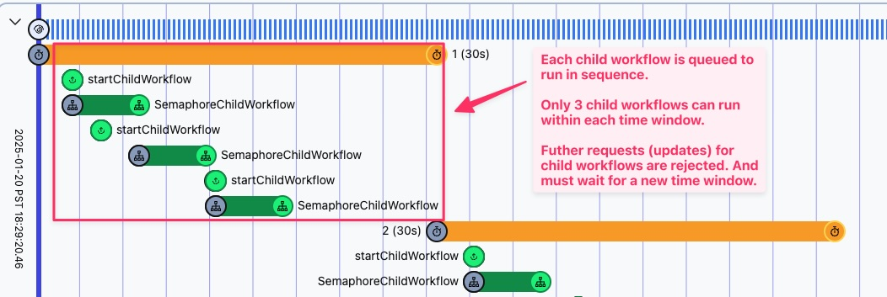

# Temporal Workflow Sample: Semaphore

### Overview
This example demonstrates a time-windowed semaphore implemented using a Temporal workflow. A semaphore is a synchronization tool that limits the number of processes that can access a shared resource. This workflow runs indefinitely, managing the execution of child workflows. Send workflow Updates to start a child workflow.



There's a configurable time window (e.g., one minute) where a maximum number of child workflows allowed to execute within that window (default is 3, set in `src/workflows.ts` as `MAX_CHILD_EXECUTIONS`). If you try to start more child workflows than allowed during a time window, the update request will respond with REJECTED. In that case, you'll need to wait until the current time window expires and refreshes before you can kick off additional child workflows. The time window will reset, allowing you to start more workflows when ready. The workflow ensures that child workflows are queued and run sequentially, useful for use cases where you want to limit the number of concurrent processes accessing a shared resource.

### Running this sample

The sample is configured by default to connect to a [local Temporal Server](https://docs.temporal.io/cli#starting-the-temporal-server) running on localhost:7233

```
temporal server start-dev
```

To instead connect to Temporal Cloud, set the following environment variables, replacing them with your own Temporal Cloud credentials.

With mTLS certs:

```bash
TEMPORAL_ADDRESS=testnamespace.sdvdw.tmprl.cloud:7233
TEMPORAL_NAMESPACE=testnamespace.sdvdw
TEMPORAL_CLIENT_CERT_PATH="/path/to/file.pem"
TEMPORAL_CLIENT_KEY_PATH="/path/to/file.key"
```

With an API key:
```bash
TEMPORAL_ADDRESS=us-west-2.aws.api.temporal.io:7233
TEMPORAL_NAMESPACE=testnamespace.sdvdw
TEMPORAL_API_KEY="your-api-key"
# ensure TEMPORAL_CLIENT_CERT_PATH and TEMPORAL_CLIENT_KEY_PATH are not set
```

* `npm install` to install dependencies.
* Run `npm run start` to start the Worker. (You can also get [Nodemon](https://www.npmjs.com/package/nodemon) to watch for changes and restart the worker automatically by running `npm run start.watch`.)
* Run `npm run workflow -- -t 1` to run the Workflow for 1 minute time windows (supports decimals, e.g. 0.5 for 30s)
* To stop the workflow, terminate it in the Temporal Web UI or CLI.
* Run `npm run requestChildWorkflow -- --id test123` to send an update to the Workflow that starts a child workflow.

### Example output (configured for max 3 child workflows per minute):

First time window
```
# Running npm run requestChildWorkflow -- --id abc123

## Update request 1
Response: {"response":"EXECUTING","queueDepth":1,"childExecutionCount":1}

## Update request 2
Response: {"response":"QUEUED","queueDepth":2,"childExecutionCount":2}

## Update request 3
Response: {"response":"QUEUED","queueDepth":2,"childExecutionCount":3}
(queue depth is 2 not 3 because the first child workflow finished)

## Update request 4
Update returns an error to the client due to max child executions reached (validation failed)
Response: Rejected child workflow with ID: abc123 - exceeds maximum of 3 child executions

## Update request 5
Update returns an error to the client due to max child executions reached (validation failed)
Response: Rejected child workflow with ID: abc123 - exceeds maximum of 3 child executions
```

Second time window
```
## Update request 1
Response: {"response":"EXECUTING","queueDepth":1,"childExecutionCount":1}

## Update request 2
Response: {"response":"QUEUED","queueDepth":2,"childExecutionCount":2}
```

### Future work
- Possibly no need to use timers in this use case (more efficient to use deterministic Datetime calculations on update?)
- Turn into Temporal TypeScript SDK sample (and pass PR review)
- Make the semaphore configurable (e.g., max child workflows)
- Add a parallel execution option instead of sequential
- Add updateWithStart so the workflow doesn't have to be running
- Add a graceful way to finish the workflow
- Unit tests