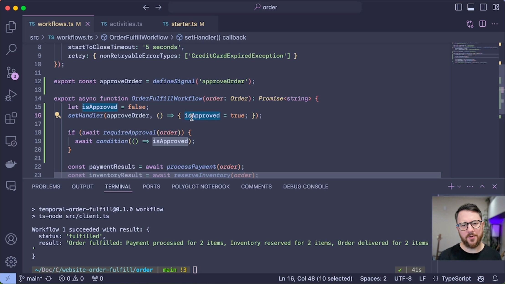

# Temporal Demo: Order Fulfillment in Typescript

### Overview
A Temporal workflow for a sample e-commerce order fulfillment use case. This demo showcases Temporal's powerful durability and interactive capabilities.

[Watch the demo  (YouTube)](https://www.youtube.com/watch?v=dNVmRfWsNkM)

[](https://www.youtube.com/watch?v=dNVmRfWsNkM)

### Running this sample

The sample is configured by default to connect to a [local Temporal Server](https://docs.temporal.io/cli#starting-the-temporal-server) running on localhost:7233

```
temporal server start-dev
```

To instead connect to Temporal Cloud, set the following environment variables, replacing them with your own Temporal Cloud credentials.

With mTLS:

```bash
TEMPORAL_ADDRESS=testnamespace.sdvdw.tmprl.cloud:7233
TEMPORAL_NAMESPACE=testnamespace.sdvdw
TEMPORAL_CLIENT_CERT_PATH="/path/to/file.pem"
TEMPORAL_CLIENT_KEY_PATH="/path/to/file.key"
```

With API key:
```bash
TEMPORAL_ADDRESS=us-west-2.aws.api.temporal.io:7233
TEMPORAL_NAMESPACE=testnamespace.sdvdw
TEMPORAL_API_KEY="your-api-key"
# ensure TEMPORAL_CLIENT_CERT_PATH and TEMPORAL_CLIENT_KEY_PATH are not set
```

`npm install` to install dependencies.

Run `npm run start` to start the Worker. (You can also get [Nodemon](https://www.npmjs.com/package/nodemon) to watch for changes and restart the worker automatically by running `npm run start.watch`.)
Run `npm run workflow -- -t 1` to run the Workflow for a 1 minute time window.
Run `npm run requestChildWorkflow -- --id abc123` to request the Workflow.

### Scenarios

See `demo` folder for different scenarios that will be live-coded into `workflows.ts`:
